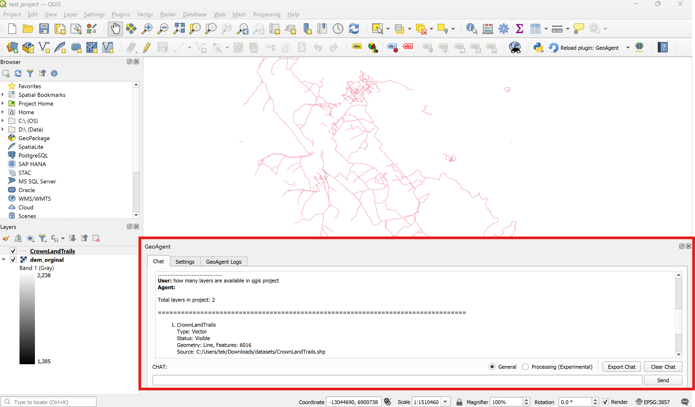
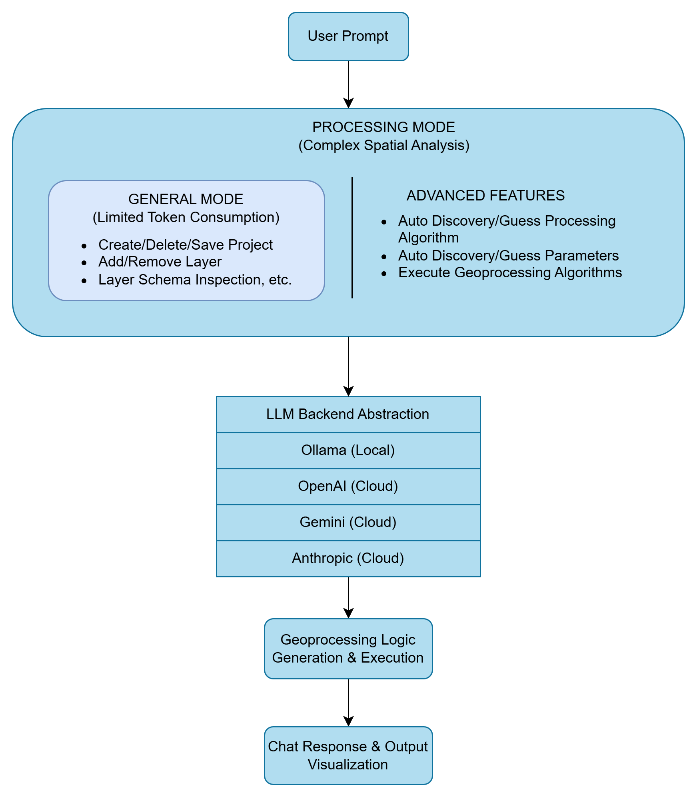

# GeoAgent

<p align="center">
  
</p>

GeoAgent is a QGIS plugin that lets you run geospatial workflows in plain English. Ask it to load data, select features, or chain geoprocessing steps — it finds the right QGIS algorithms, fills in the parameters, and adds the results to your map.

[Install from QGIS Plugin Repository](https://plugins.qgis.org/plugins/geo_agent/) · [Report an issue](https://github.com/iamtekson/GeoAgent/issues)



## What it can do

- **Layer management** — add vector/raster layers from files or URLs, list layers and columns, zoom, remove
- **Selection & queries** — select features by attribute (`=`, `>`, `contains`, ...) or by geometry (largest, inside, intersecting, ...)
- **Geoprocessing in natural language** — buffer, clip, dissolve, zonal statistics, and any other algorithm from the QGIS processing registry (native, GDAL, GRASS, ...)
- **Multi-step workflows** — one request like *"add demo.shp, buffer it by 5 km, then clip raster.tif with the buffer"* is decomposed into ordered tasks, with outputs passed from one step to the next and automatic retry on failures
- **Your choice of LLM** — Ollama (local, free), OpenAI, Google Gemini, or Anthropic Claude

The plugin has two modes, selectable with the radio buttons in the panel:

| Mode | What it's for | Example |
| --- | --- | --- |
| **General** (default) | Questions, data exploration, selections, layer management | "Which layers do I have?" |
| **Processing** | Running geoprocessing algorithms, including multi-step chains | "Buffer cities by 1 km and clip roads with it" |

<p align="center">
  
</p>

## Installation

**From the QGIS Plugin Repository (recommended):** `Plugins → Manage and Install Plugins`, search for **GeoAgent**, click *Install Plugin*.

**Manual:** download the latest [release](https://github.com/iamtekson/GeoAgent/releases), extract it into your QGIS plugins folder, restart QGIS, and enable the plugin.

| OS | Plugins folder |
| --- | --- |
| Windows | `%APPDATA%\QGIS\QGIS3\profiles\default\python\plugins\` |
| macOS | `~/Library/Application Support/QGIS/QGIS3/profiles/default/python/plugins/` |
| Linux | `~/.local/share/QGIS/QGIS3/profiles/default/python/plugins/` |

Requires QGIS 3.2 or newer (QGIS 4 supported). On first use, open the plugin's **Settings** tab and click **Install dependencies** — this installs the required Python packages (LangGraph, LangChain provider libraries) into your QGIS Python environment.

## Set up an LLM provider

Pick one provider in the dropdown, then:

| Provider | API key | Example models |
| --- | --- | --- |
| **Ollama** | not needed (runs locally) | `llama3.2:3b`, `llama3.1:8b` |
| **OpenAI** | [platform.openai.com](https://platform.openai.com/api-keys) | `gpt-5`, `gpt-5-mini` |
| **Gemini** | [aistudio.google.com](https://aistudio.google.com/app/apikey) | `gemini-3-flash-preview`, `gemini-2.5-pro` |
| **Anthropic** | [platform.claude.com](https://platform.claude.com/) | `claude-sonnet-5`, `claude-haiku-4-5` |

For the API-key providers, paste your key, type a model name, and click **Save settings** (settings survive QGIS restarts).

**Ollama quick start** (free, no account, runs on your machine):

```bash
# 1. Install from https://ollama.com/download, then:
ollama pull llama3.2:3b   # download a model
ollama serve              # make sure the server is running
```

Keep the default base URL (`http://localhost:11434`) and model name in the plugin, or change them to match your setup. If the model isn't installed yet, GeoAgent offers to pull it for you.

> **Tip:** small local models work well for General mode, but Processing mode involves structured multi-step reasoning — a larger local model (8B+) or a cloud provider gives noticeably better results.

## Usage

### General mode

```
"Add a shapefile from C:\data\cities.shp"
"What columns does the cities layer have?"
"Select cities with population greater than 100000"
"Zoom to the boundary layer"
```

### Processing mode

Single operations:

```
"Create a 500 m buffer around the cities layer"
"Clip the roads layer by the study area"
"Dissolve the parcels by district field"
```

Or a whole workflow in one message:

```
"Add C:\data\demo.shp, create a 5 km buffer for each shape,
 and clip raster.tif with the buffered layer"
```

Behind the scenes, GeoAgent:

1. Splits your request into ordered tasks and decides which need geoprocessing
2. Searches the full QGIS algorithm registry and picks the best match per task
3. Fills the algorithm parameters from your wording (units like "5 km" are converted)
4. Runs the algorithm; on failure it diagnoses the error and retries with a fix (up to 2 times)
5. Loads outputs into your project and feeds them into the next task
6. Posts a summary of what was done

### Writing good prompts

- Name your layers and include units: *"buffer **cities** by **500 m**"*, not *"make a buffer"*
- Reference earlier results naturally: *"...and clip the roads with **that buffer**"*
- File paths work as inputs even if the layer isn't loaded yet

### Panel controls

**Temperature** (0–1, default 0.8) — lower is more deterministic, better for precise processing tasks. **Max tokens** — caps response length. **Export chat / Clear chat** — save or reset the conversation. The **Logs** tab shows each workflow step, which is the first place to look when something goes wrong.

## Troubleshooting

| Problem | Fix |
| --- | --- |
| Ollama connection failed | Check `ollama serve` is running and the base URL is `http://localhost:11434` |
| Model not responding | Verify the API key and model name; check your internet connection |
| "Layer not found" | Ask "what layers are loaded?" and use the exact name (or the file path) |
| Wrong algorithm/parameters chosen | Rephrase with the operation and units stated explicitly; check the Logs tab to see what was selected |
| Missing package errors | Settings tab → **Install dependencies**, then restart QGIS |
| Plugin misbehaving after update | Restart QGIS, or disable and re-enable the plugin |

## Development

```
geo_agent/
├── agents/                  # LangGraph graphs
│   ├── graph.py             #   entry points (general + processing modes)
│   ├── workflow.py          #   multi-step task loop (decompose → route → execute)
│   ├── geoprocessing_flow.py#   geoprocessing sub-graph (discover → params → run → retry)
│   ├── states.py            #   graph state definitions
│   └── schemas.py           #   structured-output schemas
├── tools/                   # LangChain tools wrapping QGIS (I/O, selection, processing)
├── llm/                     # Provider clients + background worker thread
├── prompts/                 # System prompts
├── dialogs/                 # Qt UI
├── config/                  # Settings and constants
├── utils/                   # Dependency installer, layer matching, helpers
└── geo_agent.py             # Main plugin class
```

Contributions are welcome — fork, create a feature branch, and open a pull request. For bugs, [open an issue](https://github.com/iamtekson/GeoAgent/issues) with your QGIS version, plugin version, and steps to reproduce.

## License & credits

MIT License — see [LICENSE](LICENSE). GeoAgent's own code is MIT-licensed; when it runs inside QGIS (GPL v2+, with PyQt under GPL v3), the combined work is governed by those licenses' terms, as with any QGIS plugin.

**Authors:** [Tek Kshetri](https://github.com/iamtekson), [Rabin Ojha](https://github.com/rabenojha)

Related projects that inspired this work: [QChatGPT](https://github.com/KIOS-Research/QChatGPT), [GeoAI](https://github.com/opengeos/geoai/tree/main/qgis_plugin), [QGIS MCP](https://github.com/jjsantos01/qgis_mcp). Thanks to the QGIS, LangChain, and open-source GIS communities.
