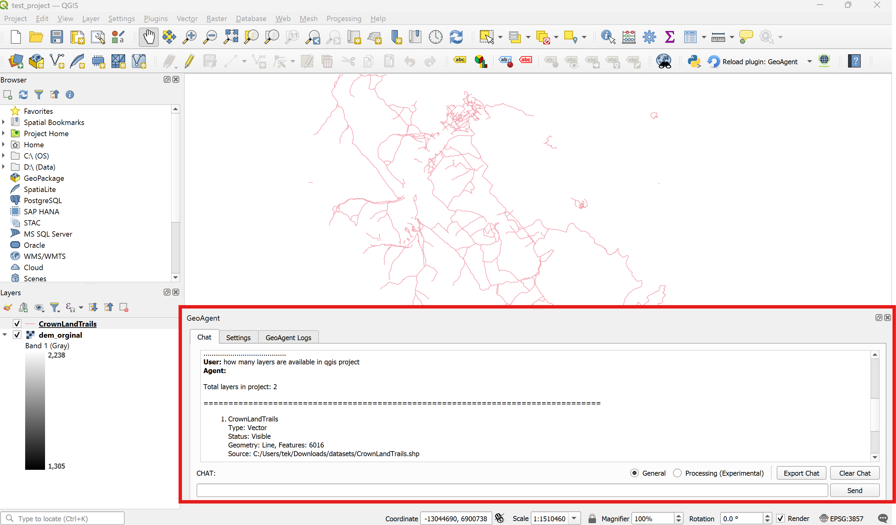

# GeoAgent

<p align="center">
  
</p>

GeoAgent is a QGIS plugin for geospatial analysis in plain language. Ask it to load data, explore your layers, or run a chain of processing steps: it picks the QGIS algorithms, fills in their parameters, runs them, and adds the results to your map.

**[Documentation](https://geoagent.readthedocs.io)** · [Install from the QGIS Plugin Repository](https://plugins.qgis.org/plugins/geo_agent/) · [Report an issue](https://github.com/iamtekson/GeoAgent/issues)



## Features

- **Explore and manage data** (General mode) — add layers from files or URLs, list layers and columns, select features by attribute or geometry, create and save projects.
- **Geoprocessing in plain language** (Processing mode) — any algorithm in the Processing Toolbox (native, GDAL, GRASS, ...), alone or as a multi-step chain where each result feeds the next.
- **Turn a run into a QGIS model** — open it in the Model Designer, or save it as a `.model3` file to re-run on other data.
- **Your choice of LLM** — Ollama (local and free), OpenAI, Google Gemini, or Anthropic Claude.
- **See what happened** — every step, the parameters used, and the tokens each request cost, in the Logs tab.

## Quick start

1. Install **GeoAgent** from **Plugins ▸ Manage and Install Plugins**.
2. In the GeoAgent panel's **Settings** tab, click **Check / Install Dependencies**.
3. Choose a provider: [Ollama](https://ollama.com) runs locally for free; OpenAI, Gemini and Anthropic need an API key. Click **Save Settings**. See [LLM providers](https://geoagent.readthedocs.io/en/latest/llm-providers.html).
4. Switch to **Processing** mode and describe your analysis:

   ```text
   Buffer the rivers by 500 m, clip the DEM with the buffer and compute the slope of the clipped DEM
   ```

The [quickstart](https://geoagent.readthedocs.io/en/latest/quickstart.html) walks through this example with the demo data.

## Documentation

- [Getting started](https://geoagent.readthedocs.io/en/latest/installation.html) — installation, LLM providers, quickstart
- [User guide](https://geoagent.readthedocs.io/en/latest/user-guide/general-mode.html) — General and Processing modes, model export, settings, logs and token usage, troubleshooting
- [Developer guide](https://geoagent.readthedocs.io/en/latest/developer-guide/architecture.html) — architecture, tests, contributing

## Contributing

Contributions are welcome — fork, create a feature branch, and open a pull request. The [contributing guide](https://geoagent.readthedocs.io/en/latest/developer-guide/contributing.html) covers the development setup, the [tests](tests/README.md), and building the docs. For bugs, [open an issue](https://github.com/iamtekson/GeoAgent/issues) with your QGIS version, plugin version, and steps to reproduce.

## License & credits

MIT License — see [LICENSE](LICENSE). GeoAgent's own code is MIT-licensed; when it runs inside QGIS (GPL v2+, with PyQt under GPL v3), the combined work is governed by those licenses' terms, as with any QGIS plugin.

**Authors:** [Tek Kshetri](https://github.com/iamtekson), [Rabin Ojha](https://github.com/rabenojha)

Related projects that inspired this work: [QChatGPT](https://github.com/KIOS-Research/QChatGPT), [GeoAI](https://github.com/opengeos/geoai/tree/main/qgis_plugin), [QGIS MCP](https://github.com/jjsantos01/qgis_mcp). Thanks to the QGIS, LangChain, and open-source GIS communities.

## Citation

<!-- citation-start -->
If you use GeoAgent in your research, please cite the preprint:

> Kshetri, T. B., & Ojha, R. (2026). *GeoAgent: An Agent-Based QGIS Plugin for Natural-Language-Driven Geospatial Analysis with Multi-Backend Large Language Model Support.* EarthArXiv. https://doi.org/10.31223/X53803

```bibtex
@misc{kshetri2026geoagent,
  title     = {GeoAgent: An Agent-Based QGIS Plugin for Natural-Language-Driven
               Geospatial Analysis with Multi-Backend Large Language Model Support},
  author    = {Kshetri, Tek Bahadur and Ojha, Rabin},
  year      = {2026},
  publisher = {EarthArXiv},
  doi       = {10.31223/X53803},
  url       = {https://doi.org/10.31223/X53803}
}
```
<!-- citation-end -->
