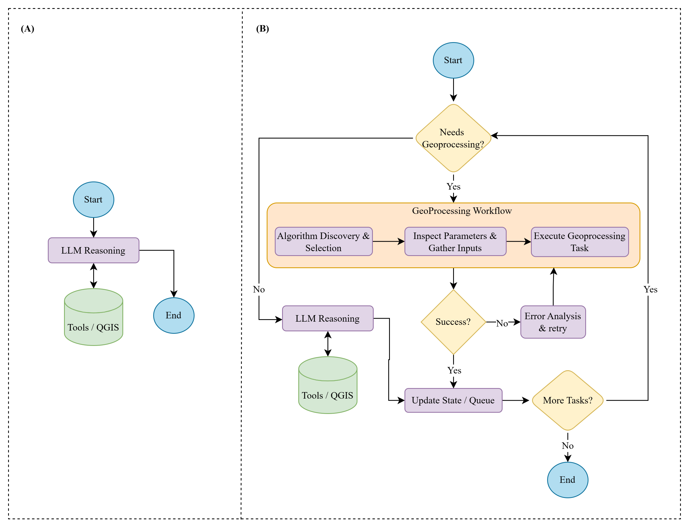

# Architecture

GeoAgent is a Python QGIS plugin built on [LangGraph](https://langchain-ai.github.io/langgraph/). Both modes are LangGraph state graphs running on a common LLM provider layer.


## Code map

| Path | Contents |
| --- | --- |
| `geo_agent.py` | The plugin class: dock widget, chat display, worker thread, model-export links, token usage logging. |
| `dialogs/` | The dock UI (`geo_agent_dialog_base.ui`) and its settings logic. |
| `agents/graph.py` | Entry points: builds the General or Processing graph and invokes it. |
| `agents/workflow.py` | Processing mode's outer loop: split into tasks, route, run, summarize. |
| `agents/geoprocessing_flow.py` | Sub-graph that runs one geoprocessing task: find, fill, check, run, retry. |
| `agents/states.py`, `agents/schemas.py` | Graph state types and the Pydantic schemas for structured LLM output. |
| `prompts/system.py` | System prompts. |
| `tools/` | LangChain tools wrapping QGIS: layer and project I/O, selection, and processing (search, parameter inspection, normalization, validation, execution). |
| `llm/` | Provider clients, the background worker thread, token usage tracking. |
| `utils/` | Layer-name matching, main-thread dispatch, model export, dependency installer, Markdown rendering. |

## General mode

A conversational loop (`build_graph_app` in `agents/graph.py`): the LLM answers or calls tools, sees the tool results, and continues until it can reply (panel A below). Conversation memory is a LangGraph checkpointer keyed by the chat's thread id. Only the most recent 20 messages are sent to the model.

## Processing mode



The outer workflow (`agents/workflow.py`, panel B):

1. **decompose**: one structured LLM call splits the request into tasks (`TaskDecomposition`). Each task carries an operation, an `is_geoprocessing` flag, search keywords, dependencies and stated parameters.
2. **prepare_task**: routes the task using `is_geoprocessing`. Only if the model left it out does a separate routing LLM call decide.
3. **geoprocessing** runs the task through the sub-graph below. **llm_task** handles anything else with the LLM and the QGIS tools; layers it adds become that task's outputs. Both record the task's result and queue its outputs as `task_N_output` labels for dependent tasks, by name for the prompts and by layer id for wiring.
4. **update_state** moves to the next task. After a failed task, the workflow stops.
5. **finalize** writes the summary shown in the chat.

### The geoprocessing sub-graph

Each geoprocessing task runs in its own scoped state (`GeoTaskState`):

```{mermaid}
flowchart TD
    discover["discover<br/>score every registered algorithm"] --> select["select<br/>LLM picks one (shortlist, then full catalog)"]
    select --> inspect["inspect<br/>parameter definitions + help text"]
    inspect --> gather["gather<br/>LLM fills parameters; slips normalized"]
    gather --> check{"QGIS parameter check"}
    check -- valid --> run["run the algorithm"]
    run -- success --> done(["outputs added to the project"])
    check -- rejected --> analysis["error analysis"]
    run -- failure --> analysis
    analysis -- "bad parameter (once per algorithm)" --> gather
    analysis -- "wrong algorithm, bad data or unknown" --> select
```

- **Normalization** (`normalize_parameters` in `tools/geoprocessing.py`) only rewrites values QGIS would reject: near-miss layer names, enum labels, parameter-name case, `task_N_output` labels. It also pins a name that matches this run's output to that output's layer id.
- **The parameter check** (`validate_parameters`) is QGIS's own `checkParameterValues`, the same check `processing.run` performs, so it never rejects anything that would have run. A rejection skips the LLM error analysis and names every bad value.
- **Retries** are capped at two per task (`MAX_RETRIES`). A "bad parameter" verdict re-gathers parameters for the same algorithm once. Anything else excludes the algorithm and re-selects.

Successful tasks store a JSON-safe record of the step (algorithm, parameters, output layer ids) in `task_results`. Model export is built from these records.

## Threading

Each request runs in a `QThread` (`llm/worker.py`) with its own asyncio loop, so QGIS stays responsive. Tools that touch the project or the map canvas (`tools/io.py`, `tools/filters.py`) are decorated with `@qgis_main_thread`: `utils/canvas_refresh.py` runs them on the main thread and waits for the result. Processing algorithms run in the worker thread through `processing.run`.

## Model export

After a processing request, the plugin reads the run's step records from the graph's checkpoint (`app.get_state`) and keeps them per run id. The links under the reply use the `geoagent-model:` URL scheme, handled in `GeoAgent._on_chat_link_clicked`. `utils/model_export.py` builds a `QgsProcessingModelAlgorithm` from the records:

- one child algorithm per step;
- earlier outputs wired as child outputs;
- user layers as model inputs;
- unconsumed results as model outputs.

The model can then be opened in the Model Designer or written to `.model3`.

## Token usage

`llm/usage.py` defines `TokenUsageTracker`, a LangChain callback handler. The worker passes it in the graph's run config, so every LLM call in the request reports to it, including calls inside sub-graphs and structured-output calls. When the worker finishes, the plugin logs its summary line.
