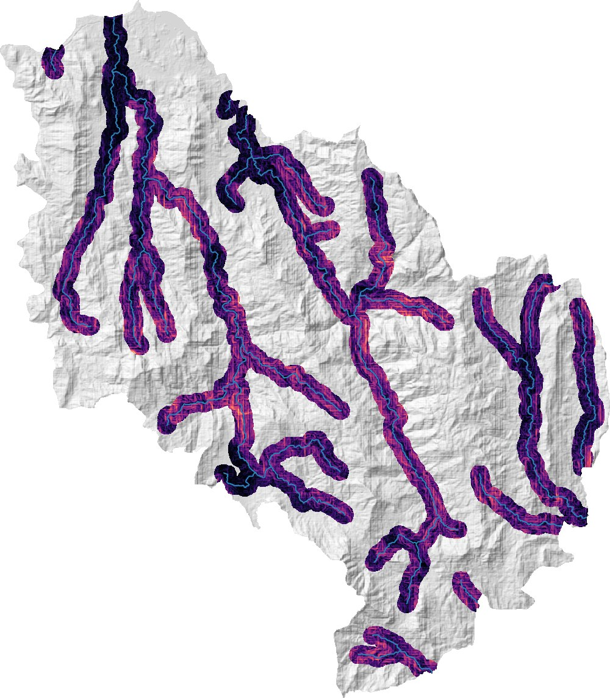
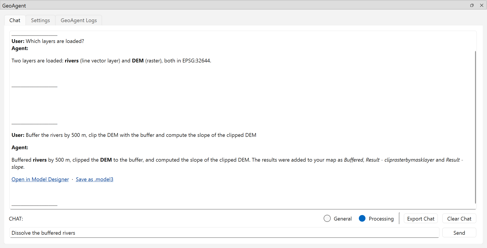
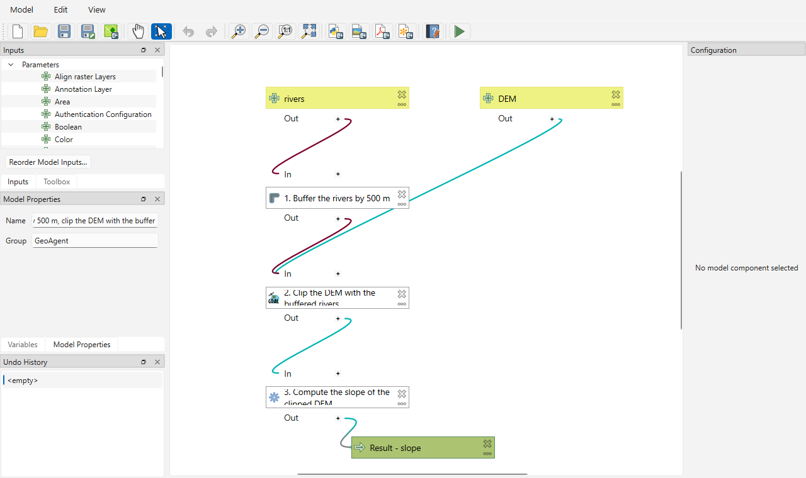

# Quickstart

This walk-through uses the small demo dataset from the GeoAgent repository: a river network (`rivers.shp`) and an elevation model (`DEM.tif`) of the same area. Download both from [paper/demo_dataset](https://github.com/iamtekson/GeoAgent/tree/main/paper/demo_dataset) on GitHub. For the shapefile, download all the `rivers.*` files.

You need GeoAgent [installed](installation.md) with a [provider connected](llm-providers.md).

## 1. Load the data

Make sure **General** mode is selected in the Chat tab, and ask GeoAgent to add the layers (use your own paths):

```text
Add C:/data/demo_dataset/shp/rivers.shp and C:/data/demo_dataset/tiff/DEM.tif
```

Then check what's loaded:

```text
Which layers are loaded?
```

## 2. Run a processing chain

Switch to **Processing** mode and describe the whole analysis in one message:

```text
Buffer the rivers by 500 m, clip the DEM with the buffer and compute the slope of the clipped DEM
```

GeoAgent splits this into three tasks, picks an algorithm for each (`native:buffer`, `gdal:cliprasterbymasklayer`, `native:slope`), passes each result to the next task, and adds the results to your map:



The reply summarizes what was done:



## 3. See it as a model

Click **Open in Model Designer** under the reply. QGIS's Model Designer shows the three steps, their parameters, and how the results flow from one to the next:



From here you can change parameters, run the model on other rivers or elevation data, or save it. **Save as .model3** saves it directly. See [Model export](user-guide/model-export.md).

## Next steps

- [Processing mode](user-guide/processing-mode.md): how requests are interpreted, and how to word them.
- [Logs and token usage](user-guide/logs-and-usage.md): follow each step, and see what each request cost.
