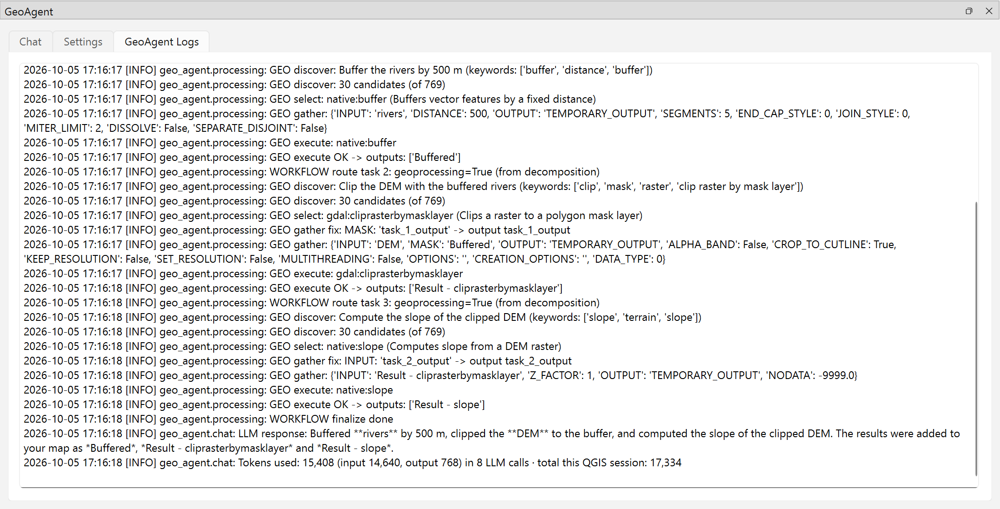

# Logs and token usage

## The Logs tab

The **GeoAgent Logs** tab shows what happens behind each reply: the tasks a request was split into, the algorithm chosen for each, the parameters used, any corrections or retries, and the outputs. It's the first place to look when a result isn't what you expected.



Lines you'll often see in Processing mode:

| Line | Meaning |
| --- | --- |
| `WORKFLOW decompose -> 3 task(s)` | How the request was split. |
| `GEO select: native:buffer (...)` | The algorithm picked for a task, with the reason. |
| `GEO gather fix: INPUT: 'River' -> layer 'rivers'` | A slip that was corrected before running. |
| `GEO gather: {...}` | The parameters the algorithm ran with. |
| `GEO pre-flight check failed: ...` | QGIS rejected a parameter before running; GeoAgent retries with a fix. |
| `GEO retry plan: bad_parameter -> re-gather parameters for native:buffer` | How a failed task will be retried. |
| `GEO execute OK -> outputs: [...]` | The task ran; these layers were added. |

The same log is written to `geo_agent.log` in the `GeoAgent` folder of your QGIS user profile (open it with **Settings ▸ User Profiles ▸ Open Active Profile Folder**), so it's still there after a restart.

## Token usage

Every request ends its log with the tokens it used, summed over all the LLM calls it made, plus a running total for the QGIS session:

```text
Tokens used: 15,408 (input 14,640, output 768) in 8 LLM calls · total this QGIS session: 17,334
```

- **Input** tokens are what GeoAgent sent: your request, layer information, algorithm details. **Output** tokens are what the model wrote back. Cloud providers price the two differently; check your provider's pricing to turn tokens into cost.
- A processing request makes several LLM calls: splitting the request, choosing an algorithm and filling in parameters per task, analysing failures, and writing the summary. Multi-step requests therefore use more tokens than a single question.
- The counts come from your provider. If a provider doesn't report them, the line says `not reported by the provider`.
- With Ollama, tokens cost nothing, but the count still shows how much work a request took.

## Saving a conversation

**Export Chat** in the Chat tab saves the conversation as a text file.
