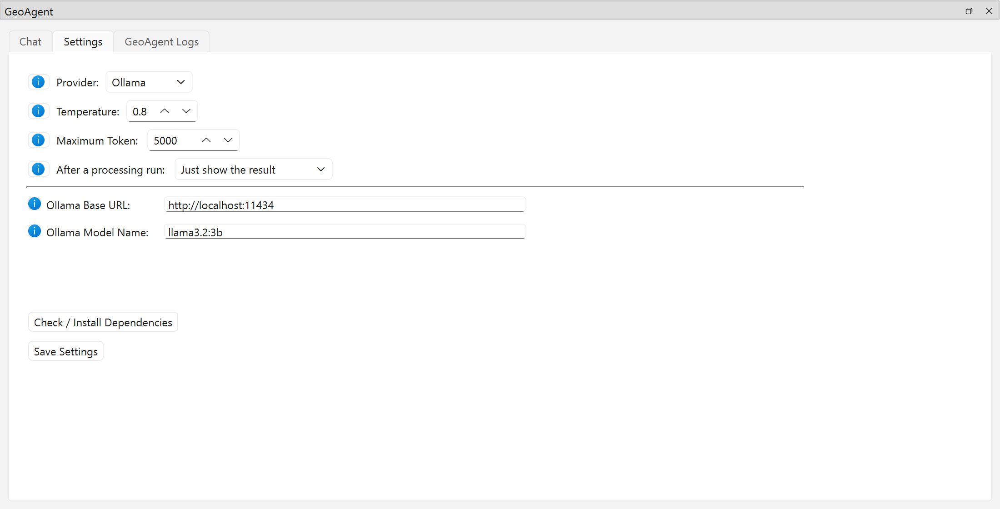

# Settings

The Settings tab of the GeoAgent panel. The **i** buttons next to each option explain it.

| Setting | What it does |
| --- | --- |
| **Provider** | Which LLM service to use: Ollama, OpenAI, Gemini or Anthropic. See [LLM providers](../llm-providers.md). |
| **Temperature** | 0 to 1 (default 0.8). Lower values make answers more consistent, which suits processing tasks. Not sent to Anthropic models. |
| **Maximum Token** | Upper limit on the length of each model response (1,000 to 100,000; default 5,000). |
| **After a processing run** | Open each processing run in the Model Designer, ask to save it as `.model3`, or just show the result (default). See [Model export](model-export.md). |
| **Model Name** / **API Key** | For OpenAI, Gemini and Anthropic: the model to use and your key. |
| **Ollama Base URL** / **Ollama Model Name** | For Ollama: the server address (default `http://localhost:11434`) and the model. |
| **Check / Install Dependencies** | Installs missing Python packages. See [Installation](../installation.md#install-the-python-dependencies). |
| **Save Settings** | Keeps all of the above across QGIS restarts, with a separate API key per provider. |
